# chat-chat
一个基于Java语言开发的简单聊天室

分为两个模块：客户端[chat-chat-client]、服务端[chat-chat-server]

通过Socket进行通信

## 技术栈

客户端：原生JDK

服务端：SpringBoot、MySQL、MyBatis-plus、Druid、Lombok、Jbcrypt、Log4J

## 项目结构

### 客户端

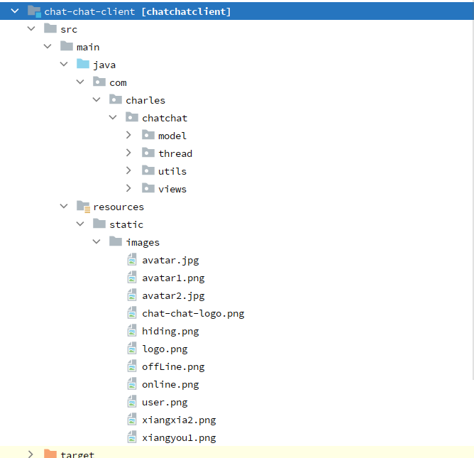

### 服务端

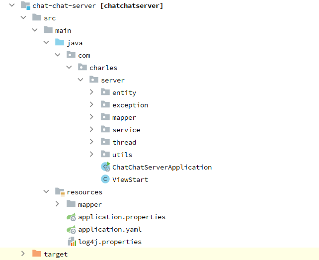

## 项目展示

注意：这里的关闭服务暂时无法使用[没有去设置]

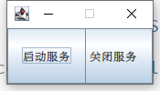

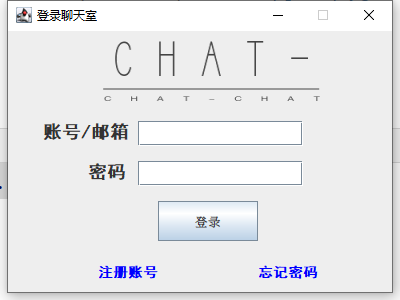

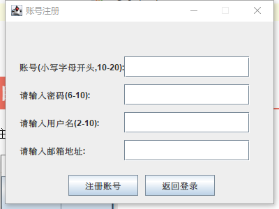

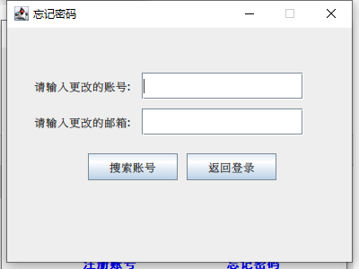

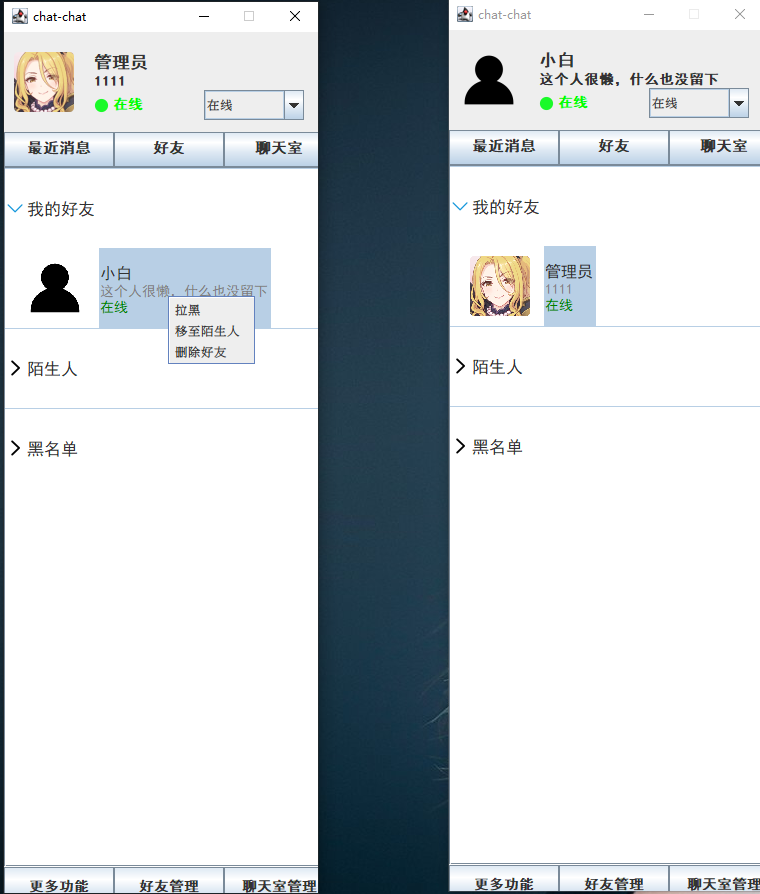

注意：由于当时时间比较赶，这里的好友管理和聊天室管理中的管理申请存在BUG，只能在对方申请添加后，打开管理申请显示一次，后续申请添加的无法显示

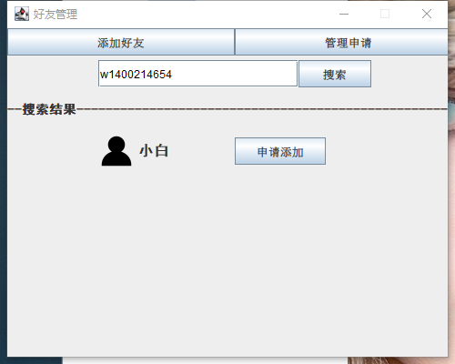

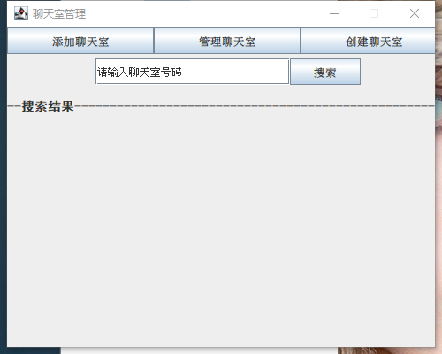

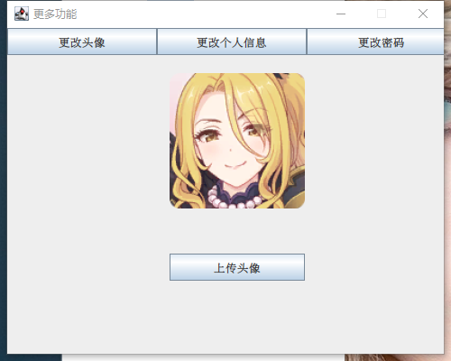

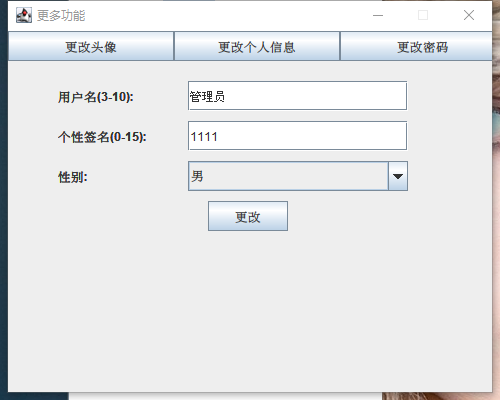

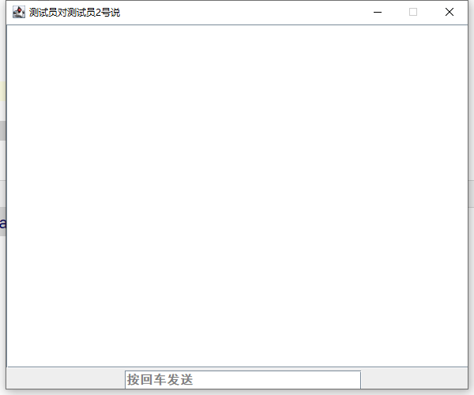

## 注意事项

除了好友管理和聊天室管理中的管理申请存在BUG以外，其它功能均无问题。由于制作该项目的时间不超过一个星期，有很多地方没有考虑到为，所以会存在一些BUG和代码不规范的问题。后续若有空，则再来进行修补。
